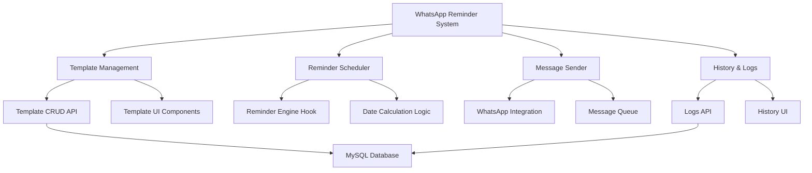

# Design Técnico - Sistema de Lembretes Automáticos de Vencimento via WhatsApp

## Overview

O sistema de lembretes automáticos será construído como uma extensão do sistema existente de geração automática de faturas, utilizando a mesma arquitetura de hooks React e APIs PHP. O sistema permitirá configurar múltiplos templates de lembrete que serão executados automaticamente em intervalos regulares.

## Architecture

### Componentes Principais



### Fluxo de Dados

1. **Configuração**: Usuário cria templates via interface
2. **Agendamento**: Sistema verifica clientes e agenda lembretes
3. **Execução**: Engine envia mensagens nos horários configurados
4. **Registro**: Sistema registra logs de envio e status

## Components and Interfaces

### 1. Database Schema

#### Tabela: `whatsapp_reminder_templates`
```sql
CREATE TABLE whatsapp_reminder_templates (
    id VARCHAR(36) PRIMARY KEY,
    reseller_id VARCHAR(36) NOT NULL,
    name VARCHAR(255) NOT NULL,
    message TEXT NOT NULL,
    reminder_type ENUM('before', 'on_due', 'after') NOT NULL,
    days_offset INT NOT NULL, -- Positivo para antes, negativo para depois
    is_active BOOLEAN DEFAULT TRUE,
    created_at TIMESTAMP DEFAULT CURRENT_TIMESTAMP,
    updated_at TIMESTAMP DEFAULT CURRENT_TIMESTAMP ON UPDATE CURRENT_TIMESTAMP,
    INDEX idx_reseller_active (reseller_id, is_active),
    INDEX idx_type_days (reminder_type, days_offset)
);
```

#### Tabela: `whatsapp_reminder_logs`
```sql
CREATE TABLE whatsapp_reminder_logs (
    id VARCHAR(36) PRIMARY KEY,
    reseller_id VARCHAR(36) NOT NULL,
    client_id VARCHAR(36) NOT NULL,
    template_id VARCHAR(36) NOT NULL,
    message_content TEXT NOT NULL,
    scheduled_date DATE NOT NULL,
    sent_at TIMESTAMP NULL,
    status ENUM('pending', 'sent', 'failed', 'cancelled') DEFAULT 'pending',
    error_message TEXT NULL,
    retry_count INT DEFAULT 0,
    created_at TIMESTAMP DEFAULT CURRENT_TIMESTAMP,
    INDEX idx_client_date (client_id, scheduled_date),
    INDEX idx_status_scheduled (status, scheduled_date),
    INDEX idx_reseller_date (reseller_id, scheduled_date)
);
```

#### Tabela: `whatsapp_reminder_settings`
```sql
CREATE TABLE whatsapp_reminder_settings (
    reseller_id VARCHAR(36) PRIMARY KEY,
    is_enabled BOOLEAN DEFAULT TRUE,
    start_hour INT DEFAULT 8, -- 8h
    end_hour INT DEFAULT 18,   -- 18h
    working_days VARCHAR(20) DEFAULT '1,2,3,4,5,6', -- Segunda a sábado
    check_interval_minutes INT DEFAULT 60,
    created_at TIMESTAMP DEFAULT CURRENT_TIMESTAMP,
    updated_at TIMESTAMP DEFAULT CURRENT_TIMESTAMP ON UPDATE CURRENT_TIMESTAMP
);
```

### 2. API Endpoints

#### Templates Management
```typescript
// GET /whatsapp-reminder-templates
// POST /whatsapp-reminder-templates
// PUT /whatsapp-reminder-templates/{id}
// DELETE /whatsapp-reminder-templates/{id}

interface ReminderTemplate {
    id: string;
    reseller_id: string;
    name: string;
    message: string;
    reminder_type: 'before' | 'on_due' | 'after';
    days_offset: number;
    is_active: boolean;
    created_at: string;
    updated_at: string;
}
```

#### Reminder Logs
```typescript
// GET /whatsapp-reminder-logs
// POST /whatsapp-reminder-logs/{id}/retry

interface ReminderLog {
    id: string;
    reseller_id: string;
    client_id: string;
    template_id: string;
    message_content: string;
    scheduled_date: string;
    sent_at?: string;
    status: 'pending' | 'sent' | 'failed' | 'cancelled';
    error_message?: string;
    retry_count: number;
    created_at: string;
}
```

#### Settings
```typescript
// GET /whatsapp-reminder-settings
// PUT /whatsapp-reminder-settings

interface ReminderSettings {
    reseller_id: string;
    is_enabled: boolean;
    start_hour: number;
    end_hour: number;
    working_days: string; // "1,2,3,4,5,6"
    check_interval_minutes: number;
}
```

### 3. React Components

#### Template Management Components
```typescript
// src/components/whatsapp/reminder-templates/
├── ReminderTemplateList.tsx      // Lista de templates
├── ReminderTemplateForm.tsx      // Formulário criar/editar
├── ReminderTemplatePreview.tsx   // Preview da mensagem
├── VariablePicker.tsx            // Seletor de variáveis
└── ReminderSettings.tsx          // Configurações globais
```

#### History Components
```typescript
// src/components/whatsapp/reminder-history/
├── ReminderHistoryList.tsx       // Lista de logs
├── ReminderHistoryFilters.tsx    // Filtros de busca
└── ReminderStats.tsx             // Estatísticas de envio
```

### 4. React Hooks

#### useReminderTemplates
```typescript
export function useReminderTemplates() {
    const [templates, setTemplates] = useState<ReminderTemplate[]>([]);
    const [isLoading, setIsLoading] = useState(true);
    
    const createTemplate = async (template: Partial<ReminderTemplate>) => {
        // Implementação
    };
    
    const updateTemplate = async (id: string, template: Partial<ReminderTemplate>) => {
        // Implementação
    };
    
    const deleteTemplate = async (id: string) => {
        // Implementação
    };
    
    return {
        templates,
        isLoading,
        createTemplate,
        updateTemplate,
        deleteTemplate,
        refresh
    };
}
```

#### useAutoReminders
```typescript
export function useAutoReminders(options: AutoReminderOptions = {}) {
    const { enabled = true, checkInterval = 60 } = options;
    
    const checkAndSendReminders = useCallback(async () => {
        // Lógica principal de verificação e envio
    }, []);
    
    useEffect(() => {
        if (!enabled) return;
        
        const interval = setInterval(checkAndSendReminders, checkInterval * 60 * 1000);
        return () => clearInterval(interval);
    }, [enabled, checkInterval, checkAndSendReminders]);
    
    return {
        checkAndSendReminders,
        isProcessing
    };
}
```

## Data Models

### Template Variables System
```typescript
interface TemplateVariable {
    key: string;
    label: string;
    description: string;
    example: string;
}

const AVAILABLE_VARIABLES: TemplateVariable[] = [
    {
        key: 'cliente_nome',
        label: 'Nome do Cliente',
        description: 'Nome completo do cliente',
        example: 'João Silva'
    },
    {
        key: 'data_vencimento',
        label: 'Data de Vencimento',
        description: 'Data de vencimento formatada',
        example: '15/10/2025'
    },
    {
        key: 'dias_restantes',
        label: 'Dias Restantes',
        description: 'Quantidade de dias até o vencimento',
        example: '3'
    },
    {
        key: 'valor',
        label: 'Valor da Mensalidade',
        description: 'Valor formatado em reais',
        example: 'R$ 49,90'
    },
    {
        key: 'plano',
        label: 'Nome do Plano',
        description: 'Nome do plano contratado',
        example: 'Plano Premium'
    }
];
```

### Message Processing
```typescript
class MessageProcessor {
    static processTemplate(template: string, client: Client, daysUntilDue: number): string {
        const variables = {
            cliente_nome: client.name,
            data_vencimento: format(parseISO(client.renewal_date), 'dd/MM/yyyy'),
            dias_restantes: Math.abs(daysUntilDue).toString(),
            valor: formatCurrency(client.value),
            plano: client.plan_name || 'Plano Padrão'
        };
        
        let processedMessage = template;
        Object.entries(variables).forEach(([key, value]) => {
            const regex = new RegExp(`{${key}}`, 'g');
            processedMessage = processedMessage.replace(regex, value);
        });
        
        return processedMessage;
    }
}
```

## Error Handling

### Retry Logic
```typescript
interface RetryConfig {
    maxRetries: number;
    retryDelay: number; // em minutos
    backoffMultiplier: number;
}

const DEFAULT_RETRY_CONFIG: RetryConfig = {
    maxRetries: 3,
    retryDelay: 30,
    backoffMultiplier: 2
};
```

### Error Categories
1. **Connection Errors**: Problemas de conectividade com WhatsApp
2. **Validation Errors**: Dados inválidos (telefone, template)
3. **Rate Limit Errors**: Limite de envios excedido
4. **Template Errors**: Problemas no processamento de variáveis

### Error Recovery
- Retry automático com backoff exponencial
- Fallback para templates padrão em caso de erro
- Notificação ao usuário sobre falhas persistentes
- Pausar envios em caso de problemas críticos

## Testing Strategy

### Unit Tests
- Processamento de templates e variáveis
- Cálculo de datas de envio
- Validação de configurações
- Lógica de retry

### Integration Tests
- Integração com API do WhatsApp
- Fluxo completo de criação e envio
- Sincronização com sistema de faturas
- Persistência de dados

### E2E Tests
- Criação de template via interface
- Configuração de lembretes
- Verificação de envios automáticos
- Visualização de histórico

### Performance Tests
- Processamento de grandes volumes de clientes
- Tempo de resposta da API
- Consumo de memória do sistema
- Throughput de envios

## Security Considerations

### Data Protection
- Criptografia de templates sensíveis
- Logs com dados anonimizados
- Controle de acesso por reseller
- Auditoria de alterações

### Rate Limiting
- Limite de envios por minuto/hora
- Throttling baseado em plano do usuário
- Proteção contra spam
- Monitoramento de uso abusivo

### Input Validation
- Sanitização de templates
- Validação de números de telefone
- Prevenção de injection attacks
- Validação de datas e horários

## Deployment Strategy

### Database Migration
```sql
-- Migrations serão executadas em ordem
-- 001_create_reminder_templates.sql
-- 002_create_reminder_logs.sql
-- 003_create_reminder_settings.sql
-- 004_add_indexes.sql
```

### Feature Flags
- Ativação gradual por reseller
- Rollback rápido em caso de problemas
- A/B testing de funcionalidades
- Monitoramento de performance

### Monitoring
- Métricas de envio (sucesso/falha)
- Alertas para falhas críticas
- Dashboard de performance
- Logs estruturados para debugging

## Performance Optimization

### Caching Strategy
- Cache de templates ativos
- Cache de configurações de usuário
- Cache de dados de clientes
- Invalidação inteligente

### Database Optimization
- Índices otimizados para consultas frequentes
- Particionamento de logs por data
- Cleanup automático de logs antigos
- Query optimization

### Background Processing
- Queue system para envios
- Processamento assíncrono
- Balanceamento de carga
- Graceful degradation